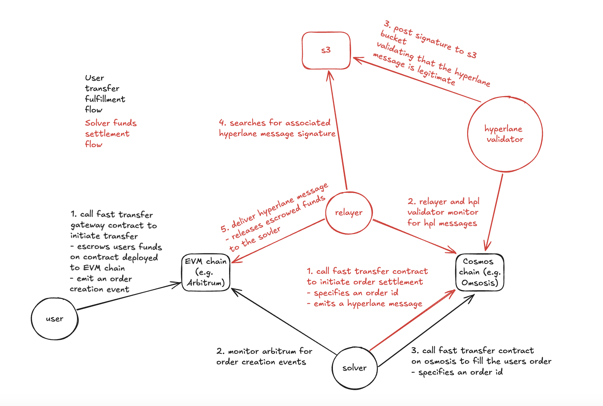

# Skip Go Fast Solver


_(note: running the skip go fast transfer solver binary deploys both the solver and hyperlane relayer components needed)_

### Solver Service Description

Solvers monitor for user transfer order creation events emitted by the Skip Go Fast Transfer contract on the source chain. A solver assesses whether fulfilling the transfer aligns with their
risk/reward profile and if they have the required resources on the destination chain to fulfill it.

### User Transfer Intent Fulfillment Flow

1. **Order Submission**: A user on the source chain wants to transfer assets along with a message payload to a destination chain within seconds. They initiate this process by calling the `submitOrder` function on the
   Skip Go Fast Transfer Protocol contract deployed on the source chain. The user provides the necessary assets, message payload, any associated fees, and desired funds destination address on the destination chain. This action
   triggers an event that solvers monitor, and a unique ID is generated to map directly to the user’s transfer order intent.
2. **Solver Detection**: Solvers monitor for intent events emitted by the Skip Go Fast Transfer contract on the source chain. A solver assesses whether fulfilling the intent aligns with their
   risk/reward profile depending on the order size and if they have the required resources on the destination chain to fulfill the intent.
3. **Fulfillment**: The solver proceeds by calling the `fillOrder` function on the Skip Go Fast Transfer Protocol contract deployed on the destination chain, executing the transfer of assets and processing the message payload
   as specified. The contract on the destination chain then executes the intended action, whether it be transferring assets to a specified address or executing a contract call with the provided assets and payload. The solver’s
   address is recorded, and a unique ID is generated to link the solver’s fulfillment to the intent solved.
4. **Completion**: From the user’s perspective, the intended transfer and message execution (if applicable) are complete, and they have successfully achieved their goal on the destination chain.

### Solver Funds Settlement Flow

1. **Settlement Initiation**: After fulfilling one or more intents, the solver on the destination chain seeks to recover any assets they fronted, along with the fees earned. The solver initiates the settlement process by
   calling the `initiateSettlement` function on the Skip Go contract deployed on the destination chain, specifying the intent IDs they fulfilled and the address on the source chain where they wish to receive their compensation.
2. **Cross-Chain Verification**: The Skip Go contract on the destination chain verifies the solver’s fulfillment of the specified IDs and dispatches a cross-chain message via a message-passing protocol. The message-passing
   protocol’s verification service ingests the payload and attests to its validity for processing on the source chain.
3. **Relay and Settlement**: A relayer from the message-passing protocol takes the attested payload and relays it to the contracts deployed on the source chain. The `handle` function is then called on the Skip Go contract
   on the source chain, which verifies that the specified intents were accurately fulfilled based on the signing set’s attestation. Upon successful verification, the assets and fees are released to the solver’s specified
   address on the source chain.
4. **Completion**: The solver has now received the assets they fronted for the user, along with the service fee they earned, completing the settlement process.

### How to start server

1. Update [config/local/keys.json](config/local/keys.json) with the corresponding solver private keys and addresses.
2. Update [config/local/config.yml](config/local/config.yml) with the corresponding chain config. Values that need to be replaced are in`<>` brackets. Set these values to configure min/max order sizes, settlement thresholds, chain rpc links, etc. Reference the [shared/config/config.go](shared/config/config.go) file for more info about the config fields.

```shell
make build # build solver server binary
# quickstart mode determines whether solver starts monitoring for user intent events from latest chain block height,
# or from the last block the solver has previously processed
make run-solver quickstart=true
```

### How to run Solver docker image

```shell
# Choose right platform to build Docker image
docker build --platform <linux/amd64|linux/arm64> -t skip-go-fast-solver .
docker run skip-go-fast-solver
```

### How to run tests

```shell
make test # run all tests
```

### Database access

```shell
make db-exec  # access sqlite shell
make db-clean # clean all existing db entries
```

### CLI Tool

submit-order: submit a fast transfer order to the deployed gateway contract specifying an amount in USDC and a recipient.
This only supports transferring USDC from EVM -> Osmosis, as any pre/post transfer swaps are typically handled by the [Skip Go](https://docs.skip.build/go/general/getting-started) API.

```shell
make build-cli
./solver ./build/solvercli submit-transfer \
  --config <configFilePath> \ # e.g ./config/local/config.yml
  --token  <usdc address for source chain> \ # e.g. 0xaf88d065e77c8cC2239327C5EDb3A432268e5831
  --recipient <recipient address on destination chain>  \ # e.g. osmo13c9seh3vgvtfvdufz4eh2zhp0cepq4wj0egc02
  --amount <usdc amount in token decimals> \ # e.g. 1000000
  --source-chain-id <source chain id>  \ # e.g. 42161
  --destination-chain-id <destination chain id>  \ # e.g. osmosis-1
  --gateway <source chain fast transfer contract gateway> \ # e.g. 0x23cb6147e5600c23d1fb5543916d3d5457c9b54c
  --private-key <source wallet EVM private key string> \ # e.g. 0xf6079d30f832f998c86e5841385a4be06b6ca2b0875b90dcab8e167eba4dcab1 (this is not stored anywhere, and is used to sign the transfer transactions)
  --deadline-hours <transfer timeout in hours> # e.g. 24
```

relay: manually relay a hyperlane transaction

```shell
make build-cli # build cli tool
# manually relay a transaction
./solvercli relay \
--config <configFilePath> \ # e.g ./config/local/config.yml
--keys <keysFilePath> \ # e.g ./config/local/keys.json
--key-store-type <plaintext-file|encrypted-file|env> \
--aes-key-hex <hexEncodedAesKey> \
--origin-chain-id <originChainId> \ # e.g. 42161
--originTxHash <tx hash to relay> \ # e.g. 0x8a345e4fb67309b230997ed222b35fd82ee31807fcd24f9ca80a4839119bb9ba
--checkpoint-storage-location-override <hplStorageFileOverride> \
```

### Main Project Modules

- transfer monitor: monitors for user transfer intent events and creates pending order fills in the solver database
- order filler: monitors for pending user order fills and fulfills them
- order settler: monitors for completed order fills and initiates process to settle solver funds
- tx verifier: verifies the status of any pending transactions related to user transfers on chain and updates the solver database
  with their latest status
- fund rebalancer: constantly checks if any configured chains are below a specified funds threshold, ands tops up funds if needed
  from other chains that have spare funds
- hyperlane: used for cross chain communication during funds settlement to validate that the user transfer has been successfully fulfilled

### Hyperlane Docs

- [Hyperlane Docs Link](https://docs.hyperlane.xyz/)
